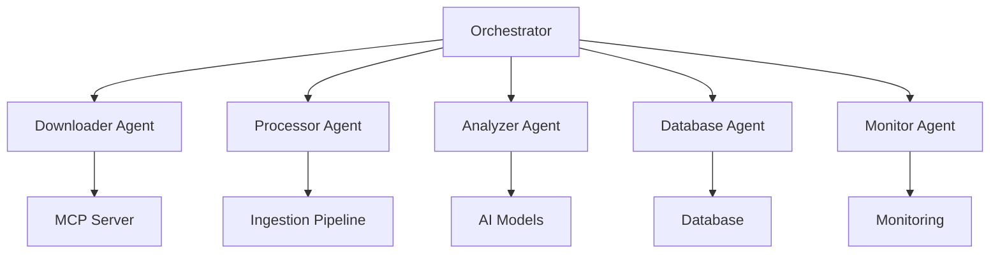

# Epstein Files Project - AI Agent Cheat Sheet

## 🎯 Overview

This cheat sheet provides comprehensive guidance for developing and working with AI agents in the Epstein Files project. It covers agent architecture, communication protocols, available tools, and best practices.

## 📚 Table of Contents

- [Agent Architecture](#agent-architecture)
- [Agent Types and Roles](#agent-types-and-roles)
- [Communication Protocols](#communication-protocols)
- [Available Tools and Capabilities](#available-tools-and-capabilities)
- [Development Guidelines](#development-guidelines)
- [Integration Patterns](#integration-patterns)
- [Error Handling](#error-handling)
- [Performance Optimization](#performance-optimization)
- [Security Considerations](#security-considerations)
- [Debugging and Troubleshooting](#debugging-and-troubleshooting)

## 🏗️ Agent Architecture

### Multi-Agent System Design



### Core Components

1. **Agent Orchestrator** - Central coordination and task distribution
2. **Specialized Agents** - Focused on specific tasks
3. **Tool Interfaces** - Access to MCP servers and utilities
4. **Communication Bus** - Inter-agent messaging
5. **State Management** - Task tracking and persistence

### Agent Lifecycle

```
Initialization → Ready → Processing → Completed/Failed → Cleanup
```

## 🤖 Agent Types and Roles

### 1. Orchestrator Agent

**Location**: [`agents/multi_agent_orchestrator.py`](agents/multi_agent_orchestrator.py)

**Responsibilities**:
- Task distribution and workload balancing
- Agent coordination and communication
- Progress monitoring and reporting
- Error handling and recovery
- Resource allocation

**Key Methods**:
- `distribute_tasks()` - Assign tasks to agents
- `monitor_progress()` - Track task completion
- `handle_errors()` - Manage failures
- `balance_load()` - Optimize resource usage

### 2. Downloader Agent

**Location**: [`agents/govinfo_downloader.py`](agents/govinfo_downloader.py)

**Responsibilities**:
- Document discovery from government sources
- Download management and progress tracking
- Collection organization and metadata extraction
- Integration with MCP download server

**Key Methods**:
- `discover_collections()` - Find available collections
- `download_collection()` - Bulk document download
- `track_progress()` - Monitor download status
- `retry_failed()` - Handle download failures

### 3. Document Processor Agent

**Location**: [`agents/epstein_data_processor.py`](agents/epstein_data_processor.py)

**Responsibilities**:
- Document preprocessing and normalization
- Text extraction and OCR processing
- Content analysis and feature extraction
- Metadata enrichment

**Key Methods**:
- `extract_text()` - Text extraction from documents
- `perform_ocr()` - Optical character recognition
- `normalize_content()` - Content standardization
- `extract_features()` - Feature extraction

### 4. Entity Extraction Agent

**Location**: [`agents/entity_extraction_agent.py`](agents/entity_extraction_agent.py)

**Responsibilities**:
- Named Entity Recognition (NER)
- Relationship extraction
- Entity resolution and linking
- Knowledge graph construction

**Key Methods**:
- `extract_entities()` - Identify entities in text
- `resolve_entities()` - Entity disambiguation
- `build_relationships()` - Relationship mapping
- `construct_graph()` - Knowledge graph creation

### 5. Database Agent

**Location**: [`agents/db_troubleshooter.py`](agents/db_troubleshooter.py)

**Responsibilities**:
- Database operations and queries
- Schema management
- Data validation and integrity
- Performance optimization

**Key Methods**:
- `execute_query()` - Run database queries
- `validate_data()` - Data quality checks
- `optimize_performance()` - Query optimization
- `manage_schema()` - Schema operations

### 6. Vector DB Analyzer Agent

**Location**: [`agents/vector_db_analyzer.py`](agents/vector_db_analyzer.py)

**Responsibilities**:
- Vector database management
- Semantic search operations
- Collection analysis
- Performance monitoring

**Key Methods**:
- `create_collection()` - Collection management
- `perform_search()` - Semantic search
- `analyze_collection()` - Collection metrics
- `optimize_indexes()` - Performance tuning

### 7. Pipeline Monitor Agent

**Location**: [`agents/pipeline_monitor.py`](agents/pipeline_monitor.py)

**Responsibilities**:
- Real-time pipeline monitoring
- Performance metrics collection
- Alert generation
- Status reporting

**Key Methods**:
- `collect_metrics()` - Gather performance data
- `generate_alerts()` - Create notifications
- `report_status()` - System status updates
- `analyze_trends()` - Performance analysis

## 📞 Communication Protocols

### MCP (Model Context Protocol)

**Protocol**: HTTP/JSON-based RPC
**Endpoint**: `http://localhost:8765` (default)
**Authentication**: API key or JWT

#### Request Format

```json
{
  "server_name": "epstein_files_downloader",
  "tool_name": "discover_collections",
  "params": {
    "collection_id": "epstein_court_files"
  },
  "request_id": "req_12345",
  "timestamp": "2025-12-24T01:00:00Z"
}
```

#### Response Format

```json
{
  "status": "success",
  "result": [
    {
      "collection_id": "epstein_court_files",
      "name": "Epstein Court Documents",
      "document_count": 1500
    }
  ],
  "request_id": "req_12345",
  "timestamp": "2025-12-24T01:00:01Z",
  "metrics": {
    "processing_time": 0.5
  }
}
```

### Inter-Agent Communication

**Protocol**: Async message queue (Redis/ RabbitMQ)
**Format**: JSON messages
**Channels**: `agent_communication`, `task_updates`, `error_reports`

#### Message Types

1. **Task Assignment**
```json
{
  "type": "task_assignment",
  "task_id": "task_123",
  "agent_id": "processor_1",
  "payload": {"document_id": "doc_456"},
  "priority": "high"
}
```

2. **Status Update**
```json
{
  "type": "status_update",
  "task_id": "task_123",
  "status": "processing",
  "progress": 50,
  "timestamp": "2025-12-24T01:00:00Z"
}
```

3. **Error Report**
```json
{
  "type": "error_report",
  "task_id": "task_123",
  "error_code": "OCR_FAILED",
  "message": "Text extraction failed",
  "severity": "high"
}
```

## 🧰 Available Tools and Capabilities

### MCP Server Tools

**Server**: Epstein Files Downloader MCP Server
**Endpoint**: `http://localhost:8765`

#### 1. Collection Discovery

**Tool**: `discover_collections`
**Description**: Find available Epstein document collections
**Parameters**: None
**Returns**: Array of collection objects

**Example**:
```python
collections = client.call_tool(
    server_name="epstein_files_downloader",
    tool_name="discover_collections"
)
```

#### 2. Document Listing

**Tool**: `list_collection_documents`
**Description**: List documents in a collection
**Parameters**:
- `collection_id` (string)
- `limit` (integer, default: 100)
- `offset` (integer, default: 0)

**Example**:
```python
documents = client.call_tool(
    server_name="epstein_files_downloader",
    tool_name="list_collection_documents",
    params={"collection_id": "epstein_court_files"}
)
```

#### 3. Single Download

**Tool**: `download_document`
**Description**: Download single document
**Parameters**:
- `url` (string)
- `destination` (string, optional)
- `metadata` (object, optional)

**Example**:
```python
task = client.call_tool(
    server_name="epstein_files_downloader",
    tool_name="download_document",
    params={"url": "https://example.com/doc.pdf"}
)
```

#### 4. Bulk Download

**Tool**: `bulk_download`
**Description**: Download entire collection
**Parameters**:
- `collection_id` (string)
- `destination` (string, optional)
- `filter_criteria` (object, optional)

**Example**:
```python
tasks = client.call_tool(
    server_name="epstein_files_downloader",
    tool_name="bulk_download",
    params={"collection_id": "epstein_court_files"}
)
```

### AI Model Tools

**Service**: OpenRouter AI Models
**Endpoint**: `https://openrouter.ai/api/v1`

#### 1. Text Generation

**Tool**: `generate_text`
**Description**: Generate text using AI models
**Parameters**:
- `model` (string): Model name
- `prompt` (string): Input prompt
- `max_tokens` (integer, default: 100)
- `temperature` (float, default: 0.7)

**Example**:
```python
text = ai_client.generate_text(
    model="mistralai/mistral-7b-instruct",
    prompt="Summarize this document:",
    max_tokens=500
)
```

#### 2. Document Analysis

**Tool**: `analyze_document`
**Description**: Analyze document content
**Parameters**:
- `model` (string): Model name
- `document_text` (string): Document content
- `analysis_type` (string): "summary", "entities", "sentiment", "keywords"

**Example**:
```python
analysis = ai_client.analyze_document(
    model="mistralai/mistral-7b-instruct",
    document_text=document_content,
    analysis_type="entities"
)
```

#### 3. Chat Completion

**Tool**: `chat_completion`
**Description**: Generate chat responses
**Parameters**:
- `model` (string): Model name
- `messages` (array): Chat history
- `max_tokens` (integer, default: 100)

**Example**:
```python
response = ai_client.chat_completion(
    model="mistralai/mistral-7b-instruct",
    messages=[
        {"role": "user", "content": "What's in this document?"}
    ]
)
```

### Database Tools

**Service**: PostgreSQL Database
**Endpoint**: `postgresql://localhost:5432/epstein_db`

#### 1. Document Storage

**Tool**: `store_document`
**Description**: Store document metadata
**Parameters**:
- `document_id` (string)
- `source_id` (string)
- `file_path` (string)
- `metadata` (object)

**Example**:
```python
doc_id = db_client.store_document(
    document_id="doc_123",
    source_id="govinfo",
    file_path="./downloads/doc.pdf",
    metadata={"title": "Court Document"}
)
```

#### 2. Text Storage

**Tool**: `store_extracted_text`
**Description**: Store extracted text
**Parameters**:
- `document_id` (string)
- `page_number` (integer)
- `text_content` (string)
- `extraction_method` (string)

**Example**:
```python
text_id = db_client.store_extracted_text(
    document_id="doc_123",
    page_number=1,
    text_content="Extracted text content...",
    extraction_method="ocr"
)
```

#### 3. Entity Storage

**Tool**: `store_entities`
**Description**: Store extracted entities
**Parameters**:
- `document_id` (string)
- `entities` (array): List of entity objects

**Example**:
```python
stored_count = db_client.store_entities(
    document_id="doc_123",
    entities=[
        {
            "entity_type": "PERSON",
            "entity_text": "Jeffrey Epstein",
            "confidence": 0.95
        }
    ]
)
```

## 🛠️ Development Guidelines

### Agent Development Best Practices

1. **Single Responsibility Principle**
   - Each agent should have one clear purpose
   - Avoid mixing concerns (e.g., downloading + processing)

2. **Error Handling**
   - Implement comprehensive error handling
   - Provide meaningful error messages
   - Support retry logic for transient failures

3. **State Management**
   - Track agent state explicitly
   - Support pause/resume functionality
   - Persist critical state information

4. **Performance Optimization**
   - Use async I/O for network operations
   - Implement batch processing where possible
   - Optimize memory usage for large documents

5. **Logging and Monitoring**
   - Implement detailed logging
   - Track performance metrics
   - Generate alerts for critical issues

### Agent Structure Template

```python
#!/usr/bin/env python3
"""
Template for Epstein Files AI Agent
"""

import asyncio
import logging
from typing import Dict, Any, Optional

# Configure logging
logger = logging.getLogger(__name__)


class BaseAgent:
    """Base class for all AI agents"""
    
    def __init__(self, agent_id: str, config: Dict[str, Any]):
        self.agent_id = agent_id
        self.config = config
        self.status = "initialized"
        self.current_task = None
        
        # Initialize agent-specific components
        self._init_components()
        
        logger.info(f"🤖 Agent {agent_id} initialized")
    
    def _init_components(self):
        """Initialize agent components"""
        # Override in subclass
        pass
    
    async def start(self):
        """Start agent operations"""
        self.status = "running"
        logger.info(f"🚀 Agent {self.agent_id} started")
        
        # Start main processing loop
        await self._main_loop()
    
    async def _main_loop(self):
        """Main processing loop"""
        while self.status == "running":
            try:
                # Process tasks
                await self._process_tasks()
                
                # Small delay to prevent CPU overload
                await asyncio.sleep(0.1)
                
            except Exception as e:
                logger.error(f"❌ Agent {self.agent_id} error: {e}")
                await asyncio.sleep(1.0)
    
    async def _process_tasks(self):
        """Process pending tasks"""
        # Override in subclass
        pass
    
    async def handle_task(self, task: Dict[str, Any]) -> Dict[str, Any]:
        """Handle a specific task"""
        # Override in subclass
        return {"status": "completed"}
    
    async def stop(self):
        """Stop agent operations"""
        self.status = "stopped"
        logger.info(f"🛑 Agent {self.agent_id} stopped")
    
    def get_status(self) -> Dict[str, Any]:
        """Get current agent status"""
        return {
            "agent_id": self.agent_id,
            "status": self.status,
            "current_task": self.current_task,
            "config": self.config
        }


class ExampleAgent(BaseAgent):
    """Example agent implementation"""
    
    def __init__(self, agent_id: str, config: Dict[str, Any]):
        super().__init__(agent_id, config)
        # Agent-specific initialization
        self.task_queue = asyncio.Queue()
    
    def _init_components(self):
        """Initialize example agent components"""
        # Initialize tools, clients, etc.
        pass
    
    async def _process_tasks(self):
        """Process tasks from queue"""
        if not self.task_queue.empty():
            task = await self.task_queue.get()
            self.current_task = task["task_id"]
            
            try:
                result = await self.handle_task(task)
                logger.info(f"✅ Task {task['task_id']} completed")
                
            except Exception as e:
                logger.error(f"❌ Task {task['task_id']} failed: {e}")
                result = {"status": "failed", "error": str(e)}
            
            finally:
                self.current_task = None
                # Return result to orchestrator
                await self._return_result(result)
    
    async def handle_task(self, task: Dict[str, Any]) -> Dict[str, Any]:
        """Handle example task"""
        # Implement task-specific logic
        await asyncio.sleep(1.0)  # Simulate work
        
        return {
            "status": "completed",
            "task_id": task["task_id"],
            "result": {"processed": True}
        }
    
    async def _return_result(self, result: Dict[str, Any]):
        """Return result to orchestrator"""
        # Implement communication with orchestrator
        pass


# Usage example
async def main():
    # Create agent
    agent = ExampleAgent(
        agent_id="example_agent_1",
        config={"max_tasks": 10}
    )
    
    # Start agent
    await agent.start()
    
    # Add task to queue
    await agent.task_queue.put({
        "task_id": "task_123",
        "type": "example",
        "payload": {"data": "test"}
    })
    
    # Let agent process
    await asyncio.sleep(5.0)
    
    # Stop agent
    await agent.stop()


if __name__ == "__main__":
    asyncio.run(main())
```

## 🔗 Integration Patterns

### 1. Direct MCP Integration

```python
from mcp_client import MCPClient

# Initialize MCP client
client = MCPClient(base_url="http://localhost:8765")

# Call MCP tool
result = client.call_tool(
    server_name="epstein_files_downloader",
    tool_name="discover_collections"
)

# Process result
for collection in result:
    print(f"Found collection: {collection['name']}")
```

### 2. Async Task Processing

```python
import asyncio
from agents.base_agent import BaseAgent

class AsyncProcessorAgent(BaseAgent):
    async def process_document(self, document_path: str):
        # Read document
        with open(document_path, 'r') as f:
            content = f.read()
        
        # Process asynchronously
        await asyncio.sleep(0.1)  # Simulate async work
        
        return {"status": "processed", "content_length": len(content)}
    
    async def handle_task(self, task):
        result = await self.process_document(task["document_path"])
        return {"task_id": task["task_id"], "result": result}
```

### 3. Batch Processing Pattern

```python
from scripts.ingestion_utils import batch_process

async def process_batch(batch, *args, **kwargs):
    results = []
    for item in batch:
        # Process each item
        result = await process_item(item)
        results.append(result)
    return results

# Process large dataset in batches
documents = get_documents()
results = batch_process(documents, batch_size=10, processor=process_batch)
```

### 4. Error Handling Pattern

```python
def safe_operation(operation, max_retries=3):
    """Safe operation with retry logic"""
    for attempt in range(max_retries):
        try:
            return operation()
        except Exception as e:
            if attempt == max_retries - 1:
                raise
            await asyncio.sleep(2 ** attempt)  # Exponential backoff

# Usage
result = safe_operation(lambda: risky_operation())
```

## ⚠️ Error Handling

### Common Error Types

1. **Network Errors** - Connection failures, timeouts
2. **API Errors** - Invalid requests, rate limiting
3. **Processing Errors** - OCR failures, parsing errors
4. **Database Errors** - Connection issues, constraint violations
5. **Resource Errors** - Memory limits, disk space

### Error Handling Strategies

1. **Retry Transient Errors**
```python
async def with_retry(operation, max_retries=3):
    for attempt in range(max_retries):
        try:
            return await operation()
        except (ConnectionError, TimeoutError) as e:
            if attempt == max_retries - 1:
                raise
            await asyncio.sleep(2 ** attempt)
```

2. **Fallback Mechanisms**
```python
def extract_text_with_fallback(file_path):
    try:
        return extract_text_pdfplumber(file_path)
    except:
        try:
            return extract_text_pytesseract(file_path)
        except:
            return ""
```

3. **Error Classification**
```python
def classify_error(error):
    if isinstance(error, ConnectionError):
        return "network"
    elif isinstance(error, ValueError):
        return "validation"
    elif isinstance(error, TimeoutError):
        return "timeout"
    else:
        return "unknown"
```

4. **Error Reporting**
```python
def report_error(error, context):
    error_data = {
        "error": str(error),
        "type": type(error).__name__,
        "context": context,
        "timestamp": get_iso_timestamp()
    }
    
    # Log error
    logger.error(f"Error: {error_data}")
    
    # Send to monitoring
    monitor.track_error(error_data)
```

## ⚡ Performance Optimization

### Async I/O Best Practices

1. **Use async libraries**
```python
# Good
import aiohttp
async with aiohttp.ClientSession() as session:
    async with session.get(url) as response:
        data = await response.text()

# Bad
import requests
response = requests.get(url)  # Blocking!
```

2. **Batch network requests**
```python
async def fetch_multiple(urls):
    async with aiohttp.ClientSession() as session:
        tasks = [session.get(url) for url in urls]
        responses = await asyncio.gather(*tasks)
        return [await r.text() for r in responses]
```

3. **Limit concurrency**
```python
semaphore = asyncio.Semaphore(10)  # Max 10 concurrent operations

async def limited_operation(url):
    async with semaphore:
        return await fetch_url(url)
```

### Memory Management

1. **Stream large files**
```python
# Good
with open(large_file, 'rb') as f:
    while chunk := f.read(8192):
        process_chunk(chunk)

# Bad
with open(large_file, 'rb') as f:
    data = f.read()  # Loads entire file into memory!
```

2. **Use generators**
```python
def process_large_dataset(dataset):
    for item in dataset:
        yield process_item(item)  # Process one at a time
```

3. **Clean up resources**
```python
try:
    resource = acquire_resource()
    process(resource)
finally:
    release_resource(resource)  # Always clean up
```

### CPU Optimization

1. **Use appropriate data structures**
```python
# Good for lookups
data_dict = {item.id: item for item in items}

# Good for ordered data
def bisect_search(items, target):
    import bisect
    index = bisect.bisect_left(items, target)
    return items[index] if index < len(items) else None
```

2. **Avoid unnecessary computations**
```python
# Cache expensive operations
@functools.lru_cache(maxsize=100)
def expensive_operation(param):
    # Compute only when needed
    return result
```

3. **Use efficient algorithms**
```python
# O(n) vs O(n²)
# Good
for item in items:
    if item in lookup_set:  # O(1) lookup
        process(item)

# Bad
for item in items:
    if item in lookup_list:  # O(n) lookup
        process(item)
```

## 🔒 Security Considerations

### Data Security

1. **Input Validation**
```python
def validate_input(data, schema):
    from pydantic import ValidationError
    try:
        return schema(**data)
    except ValidationError as e:
        raise ValueError(f"Invalid input: {e}")
```

2. **Secure File Handling**
```python
def safe_file_operations(file_path):
    # Validate path
    if not Path(file_path).resolve().parent == Path("/safe/directory"):
        raise ValueError("Invalid file path")
    
    # Use context managers
    with open(file_path, 'r') as f:
        return f.read()
```

3. **API Key Management**
```python
def get_api_key():
    # Use environment variables
    import os
    return os.getenv('API_KEY')

# Never hardcode keys!
# BAD: api_key = "hardcoded_key_123"
```

### Network Security

1. **HTTPS Everywhere**
```python
# Always use HTTPS
async with aiohttp.ClientSession() as session:
    async with session.get("https://secure-api.example.com") as response:
        pass
```

2. **Request Validation**
```python
def validate_request(request):
    # Check headers
    if 'Authorization' not in request.headers:
        raise ValueError("Missing authorization")
    
    # Validate content type
    if request.headers['Content-Type'] != 'application/json':
        raise ValueError("Invalid content type")
```

3. **Rate Limiting**
```python
from slowapi import Limiter
from slowapi.util import get_remote_address

limiter = Limiter(key_func=get_remote_address)

@app.route("/api/endpoint")
@limiter.limit("5/minute")
def api_endpoint():
    return "OK"
```

## 🐛 Debugging and Troubleshooting

### Common Issues

1. **Agent Not Starting**
   - Check logs for initialization errors
   - Verify dependencies are installed
   - Check configuration files

2. **MCP Connection Failures**
   - Verify server is running: `curl http://localhost:8765/health`
   - Check network connectivity
   - Validate API endpoints

3. **Slow Performance**
   - Monitor resource usage: `top`, `htop`
   - Check for blocking operations
   - Profile agent code

4. **Memory Leaks**
   - Monitor memory usage over time
   - Check for unreleased resources
   - Use memory profilers

### Debugging Tools

1. **Logging**
```python
import logging

# Configure detailed logging
logging.basicConfig(
    level=logging.DEBUG,
    format='%(asctime)s [%(levelname)s] %(name)s: %(message)s',
    handlers=[
        logging.StreamHandler(),
        logging.FileHandler('agent.log')
    ]
)
```

2. **Profiling**
```python
# CPU profiling
def profile_agent():
    import cProfile
    profiler = cProfile.Profile()
    profiler.enable()
    
    try:
        agent.run()
    finally:
        profiler.disable()
        profiler.print_stats(sort='cumulative')
```

3. **Tracing**
```python
# Use OpenTelemetry for distributed tracing
from lib.opentelemetry_integration import trace_function

@trace_function
def critical_operation():
    # This operation will be traced
    pass
```

### Troubleshooting Checklist

1. **Verify Dependencies**
   ```bash
   pip list
   pip check
   ```

2. **Check Logs**
   ```bash
   tail -f agent.log
   journalctl -u epstein_agent -f
   ```

3. **Test Connectivity**
   ```bash
   curl -v http://localhost:8765/health
   nc -zv localhost 8765
   ```

4. **Monitor Resources**
   ```bash
   top -p $(pgrep -f "python agent.py")
   free -h
   df -h
   ```

5. **Validate Configuration**
   ```bash
   python -c "import yaml; print(yaml.safe_load(open('config.yaml')))"
   ```

## 🎓 Best Practices Summary

### Agent Development
- ✅ Follow Single Responsibility Principle
- ✅ Implement comprehensive error handling
- ✅ Use async I/O for network operations
- ✅ Track and report metrics
- ✅ Document agent capabilities

### Performance
- ✅ Batch network requests
- ✅ Limit concurrency appropriately
- ✅ Stream large files
- ✅ Use efficient data structures
- ✅ Cache expensive operations

### Security
- ✅ Validate all inputs
- ✅ Use HTTPS for all communications
- ✅ Secure API keys and credentials
- ✅ Implement rate limiting
- ✅ Sanitize file operations

### Reliability
- ✅ Implement retry logic
- ✅ Provide fallback mechanisms
- ✅ Track and classify errors
- ✅ Monitor resource usage
- ✅ Test failure scenarios

## 📚 Additional Resources

### Documentation
- **MCP Server**: [`docs/MCP_SERVER_SETUP.md`](docs/MCP_SERVER_SETUP.md)
- **Database**: [`docs/DATABASE_ASSESSMENT.md`](docs/DATABASE_ASSESSMENT.md)
- **Script Inventory**: [`docs/SCRIPT_INVENTORY.md`](docs/SCRIPT_INVENTORY.md)

### Example Agents
- **Orchestrator**: [`agents/multi_agent_orchestrator.py`](agents/multi_agent_orchestrator.py)
- **Downloader**: [`agents/govinfo_downloader.py`](agents/govinfo_downloader.py)
- **Processor**: [`agents/epstein_data_processor.py`](agents/epstein_data_processor.py)
- **Entity Extractor**: [`agents/entity_extraction_agent.py`](agents/entity_extraction_agent.py)

### Tools and Libraries
- **MCP Client**: `mcp_client.py`
- **Ingestion Pipeline**: [`scripts/ingestion_pipeline.py`](scripts/ingestion_pipeline.py)
- **Utilities**: [`scripts/ingestion_utils.py`](scripts/ingestion_utils.py)

## 🎯 Conclusion

This cheat sheet provides comprehensive guidance for developing and working with AI agents in the Epstein Files project. By following these patterns and best practices, you can create robust, efficient, and maintainable agents that integrate seamlessly with the MCP server and other components.

**Key Takeaways**:
1. **Modular Design**: Build specialized agents with clear responsibilities
2. **Robust Communication**: Use standardized MCP protocols and message formats
3. **Comprehensive Error Handling**: Implement retry logic and fallback mechanisms
4. **Performance Optimization**: Use async I/O and batch processing
5. **Observability**: Track metrics and implement detailed logging

The Epstein Files project now has a complete foundation for AI agent development, with documented patterns, tools, and best practices to support the entire document processing pipeline.