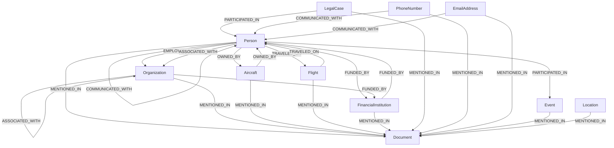

# Neo4j Knowledge Graph Schema for Epstein Analysis

## Overview

This document defines the comprehensive graph schema for the Neo4j knowledge graph used in the Epstein analysis project. The schema is designed to capture entities, relationships, and metadata extracted from Epstein-related documents through NLP and entity extraction pipelines.

The schema supports complex relationship analysis, temporal queries, and evidence-based fact-checking for investigative purposes.

## Node Types

### Core Node Types

#### Person
Represents individuals mentioned in the documents.

**Properties:**
- `id`: String (unique identifier, e.g., UUID)
- `name`: String (full legal name)
- `aliases`: List<String> (alternative names, nicknames, aliases)
- `date_of_birth`: Date (YYYY-MM-DD format)
- `date_of_death`: Date (if applicable)
- `nationality`: String (country of citizenship)
- `occupation`: String (primary profession or role)
- `gender`: String (male/female/other)
- `contact_info`: Map (key-value pairs for phone, email, address)
- `notes`: String (additional biographical information)
- `confidence_score`: Float (0.0-1.0, based on extraction confidence)
- `source_documents`: List<String> (IDs of documents where entity was found)

#### Organization
Represents companies, government agencies, non-profits, and other organizational entities.

**Properties:**
- `id`: String (unique identifier)
- `name`: String (official name)
- `type`: String (company, government, non-profit, foundation, etc.)
- `founded_date`: Date
- `dissolved_date`: Date (if applicable)
- `headquarters_location`: String (city, country)
- `industry`: String (finance, aviation, legal, etc.)
- `description`: String
- `registration_number`: String (business registration, EIN, etc.)
- `parent_organization`: String (if subsidiary)
- `confidence_score`: Float
- `source_documents`: List<String>

#### Location
Represents geographical locations, addresses, and venues.

**Properties:**
- `id`: String (unique identifier)
- `name`: String (location name)
- `type`: String (city, country, airport, address, building, island, etc.)
- `latitude`: Float
- `longitude`: Float
- `country`: String
- `state_province`: String
- `city`: String
- `address`: String (full street address if applicable)
- `timezone`: String
- `description`: String
- `confidence_score`: Float
- `source_documents`: List<String>

#### Event
Represents meetings, flights, legal proceedings, and other time-bound occurrences.

**Properties:**
- `id`: String (unique identifier)
- `name`: String (event title or description)
- `type`: String (meeting, flight, deposition, party, legal_hearing, etc.)
- `date_start`: DateTime (ISO 8601 format)
- `date_end`: DateTime (if applicable)
- `location`: String (location ID or name)
- `description`: String
- `organizer`: String (person or organization ID)
- `status`: String (scheduled, occurred, cancelled)
- `classification`: String (public, private, confidential)
- `confidence_score`: Float
- `source_documents`: List<String>

#### Document
Represents source documents, court filings, emails, flight logs, etc.

**Properties:**
- `id`: String (unique identifier)
- `title`: String
- `type`: String (court_filing, email, flight_manifest, deposition, financial_record, etc.)
- `date_created`: DateTime
- `date_modified`: DateTime
- `source_url`: String (original URL or file path)
- `content_summary`: String (extractive summary)
- `author`: String (person or organization ID)
- `recipient`: List<String> (for emails/communications)
- `page_count`: Integer
- `word_count`: Integer
- `language`: String
- `classification`: String (public, confidential, sealed)
- `tags`: List<String> (keywords, topics)
- `full_text_reference`: String (path to full text if not stored in graph)
- `confidence_score`: Float
- `source_documents`: List<String> (self-referential for provenance)

### Epstein-Specific Node Types

#### Aircraft
Represents airplanes and helicopters associated with Epstein.

**Properties:**
- `id`: String (unique identifier)
- `tail_number`: String (N-registration number)
- `model`: String (aircraft model, e.g., Gulfstream G550)
- `manufacturer`: String
- `year_manufactured`: Integer
- `owner`: String (person or organization ID)
- `operator`: String (organization ID)
- `registration_country`: String
- `max_passengers`: Integer
- `description`: String
- `confidence_score`: Float
- `source_documents`: List<String>

#### Flight
Represents individual flight records.

**Properties:**
- `id`: String (unique identifier)
- `flight_number`: String (commercial flight number or custom)
- `date`: Date
- `origin`: String (airport code or location ID)
- `destination`: String (airport code or location ID)
- `aircraft_tail`: String (aircraft ID)
- `pilot`: String (person ID)
- `crew`: List<String> (person IDs)
- `passengers`: List<String> (person IDs)
- `purpose`: String (business, personal, etc.)
- `duration_hours`: Float
- `notes`: String
- `confidence_score`: Float
- `source_documents`: List<String>

#### FinancialInstitution
Represents banks, hedge funds, and financial entities.

**Properties:**
- `id`: String (unique identifier)
- `name`: String
- `type`: String (bank, hedge_fund, trust_company, etc.)
- `location`: String (headquarters location ID)
- `founded_date`: Date
- `regulatory_status`: String
- `assets_under_management`: String (approximate range)
- `description`: String
- `confidence_score`: Float
- `source_documents`: List<String>

#### LegalCase
Represents court cases, lawsuits, and legal proceedings.

**Properties:**
- `id`: String (unique identifier)
- `case_number`: String (court docket number)
- `court`: String (court name and jurisdiction)
- `judge`: String (person ID)
- `plaintiffs`: List<String> (person/organization IDs)
- `defendants`: List<String> (person/organization IDs)
- `date_filed`: Date
- `date_closed`: Date
- `status`: String (active, dismissed, settled, ongoing)
- `case_type`: String (civil, criminal, bankruptcy, etc.)
- `description`: String
- `outcome`: String
- `confidence_score`: Float
- `source_documents`: List<String>

#### PhoneNumber
Represents telephone numbers for contact tracing.

**Properties:**
- `id`: String (unique identifier)
- `number`: String (full international number)
- `type`: String (mobile, landline, satellite)
- `carrier`: String
- `country_code`: String
- `area_code`: String
- `owner`: String (person/organization ID)
- `active_period_start`: Date
- `active_period_end`: Date
- `confidence_score`: Float
- `source_documents`: List<String>

#### EmailAddress
Represents email addresses for communication analysis.

**Properties:**
- `id`: String (unique identifier)
- `address`: String (full email address)
- `provider`: String (gmail.com, yahoo.com, etc.)
- `domain`: String
- `owner`: String (person ID)
- `active_period_start`: Date
- `active_period_end`: Date
- `confidence_score`: Float
- `source_documents`: List<String>

## Edge Types

### Core Edge Types

#### KNOWS
Represents personal or professional relationships between people.

**Attributes:**
- `since_date`: Date (when relationship began)
- `relationship_type`: String (friend, acquaintance, business_partner, family, romantic, mentor, etc.)
- `strength`: String (close, distant, professional)
- `context`: String (how they met or interact)
- `confidence_score`: Float
- `evidence`: List<String> (document IDs supporting the relationship)
- `last_contact`: Date

#### EMPLOYED_BY
Represents employment relationships.

**Attributes:**
- `role`: String (job title)
- `start_date`: Date
- `end_date`: Date
- `department`: String
- `salary_range`: String (approximate)
- `employment_type`: String (full-time, consultant, contractor)
- `supervisor`: String (person ID)
- `confidence_score`: Float
- `evidence`: List<String>

#### TRAVELED_WITH
Represents co-travel relationships.

**Attributes:**
- `date`: Date (travel date)
- `location`: String (destination or route)
- `purpose`: String (business, vacation, etc.)
- `transport_type`: String (flight, car, yacht, etc.)
- `duration_days`: Integer
- `shared_accommodation`: Boolean
- `confidence_score`: Float
- `evidence`: List<String>

### Epstein-Specific Edge Types

#### OWNED_BY
Represents ownership relationships (aircraft, properties, companies).

**Attributes:**
- `ownership_type`: String (full, partial, beneficial, trustee)
- `acquisition_date`: Date
- `disposition_date`: Date
- `ownership_percentage`: Float
- `purchase_price`: String (approximate)
- `current_value`: String (approximate)
- `confidence_score`: Float
- `evidence`: List<String>

#### TRAVELED_ON
Links people to specific flights.

**Attributes:**
- `role`: String (passenger, pilot, crew)
- `seat`: String (if known)
- `purpose`: String
- `confidence_score`: Float
- `evidence`: List<String>

#### ASSOCIATED_WITH
General association relationship for entities with unclear direct connections.

**Attributes:**
- `association_type`: String (business, social, legal, financial)
- `strength`: String (strong, weak, indirect)
- `context`: String (description of association)
- `since_date`: Date
- `confidence_score`: Float
- `evidence`: List<String>

#### FUNDED_BY
Represents financial relationships and funding sources.

**Attributes:**
- `amount`: String (approximate range)
- `currency`: String
- `date`: Date
- `purpose`: String
- `funding_type`: String (donation, investment, loan, etc.)
- `confidence_score`: Float
- `evidence`: List<String>

#### PARTICIPATED_IN
Links people/organizations to events.

**Attributes:**
- `role`: String (organizer, attendee, speaker, etc.)
- `contribution`: String (what they did)
- `duration`: String (how long they participated)
- `confidence_score`: Float
- `evidence`: List<String>

#### MENTIONED_IN
Links entities to documents where they appear.

**Attributes:**
- `mention_type`: String (subject, mentioned, referenced)
- `frequency`: Integer (how many times mentioned)
- `context`: String (sentence or paragraph excerpt)
- `confidence_score`: Float
- `evidence`: List<String> (self-referential)

#### COMMUNICATED_WITH
Represents communication relationships via phone/email.

**Attributes:**
- `communication_type`: String (phone_call, email, text, letter)
- `date`: Date
- `frequency`: String (frequent, occasional, one-time)
- `topic`: String (if known)
- `confidence_score`: Float
- `evidence`: List<String>

## Schema Visualization

## Implementation Notes

- All nodes include `id`, `confidence_score`, and `source_documents` for provenance tracking
- Edge attributes include `confidence_score` and `evidence` for fact-checking
- Dates use ISO 8601 format (YYYY-MM-DD or YYYY-MM-DDTHH:MM:SSZ)
- List properties use Neo4j array syntax
- Map properties use Neo4j map syntax
- Unique constraints should be applied to `id` properties across all node types
- Full-text indexes recommended for `name`, `title`, and `description` properties
- Spatial indexes for Location nodes with coordinates
- Temporal indexes for date-based queries

## Future Extensions

- Add Media node type for images, videos, audio
- Add Property node type for real estate
- Add Vehicle node type for cars, boats
- Add SocialMedia node type for online presence
- Add temporal versioning for relationship changes
- Add confidence decay over time for unverified relationships
