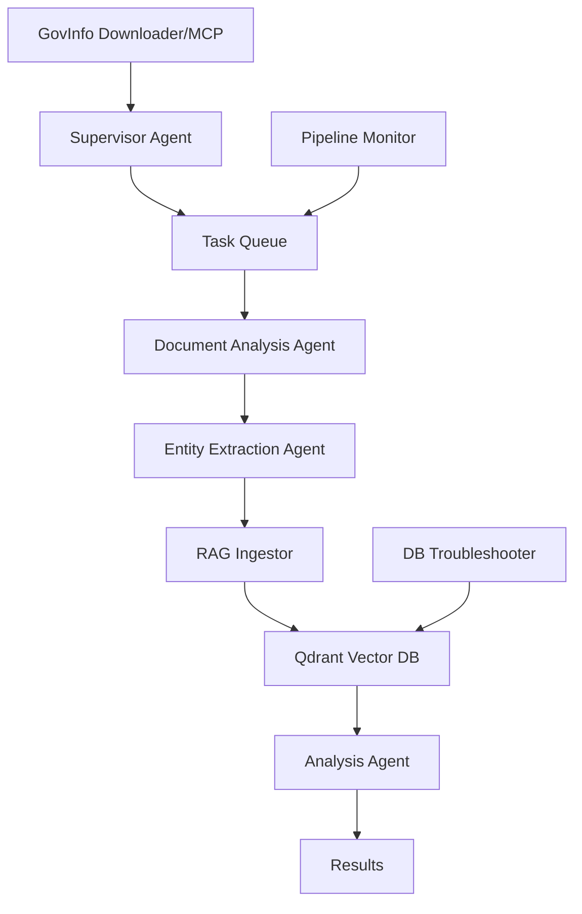
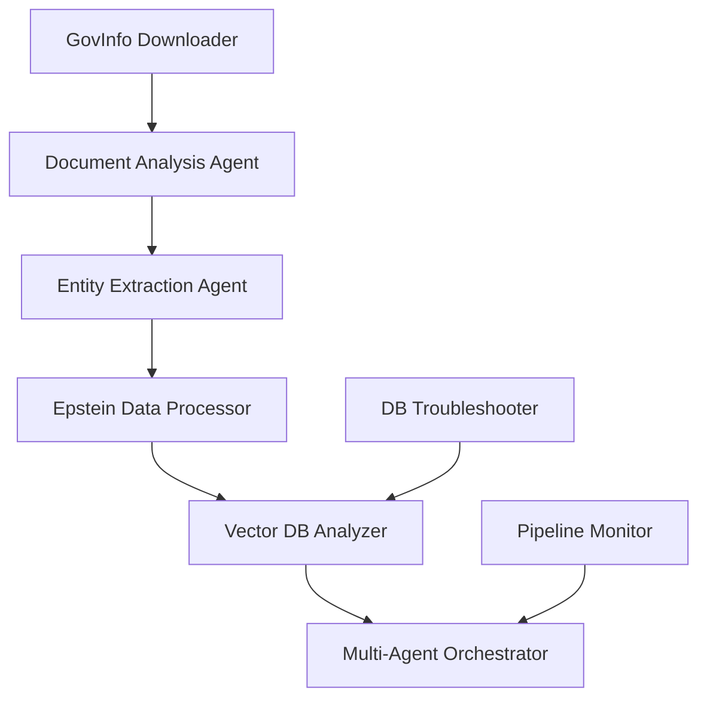

# Master Agents Documentation - Epstein Project

## Overview

This document serves as the central hub for all AI agents in the Epstein Project. It provides comprehensive information about each agent's capabilities, configurations, and interactions within the multi-agent system.

## Agent Architecture

### Agent Categories

The Epstein Project agents are organized into four main categories:

1. **Core Processing Agents** - Handle primary data processing tasks
2. **Database & Storage Agents** - Manage data persistence and retrieval
3. **Orchestration & Monitoring Agents** - Coordinate system operations
4. **Specialized Utility Agents** - Provide specific domain expertise

### Agent Communication

All agents communicate via the **Model Context Protocol (MCP)**, ensuring standardized messaging and interoperability. The MCP specification is defined in `docs/MCP_SERVER_SETUP.md`.

## Core Processing Agents

### 1. Document Analysis Agent
**File**: `agents/document_analysis_agent.py`  
**Category**: Core Processing  
**Primary Function**: Analyze and extract information from various document types

**Key Capabilities**:
- OCR processing for scanned documents
- Text extraction and cleaning
- Document type classification
- Content analysis and summarization
- Metadata extraction

**Dependencies**:
- OCR services (Tesseract, PaddleOCR)
- NLP libraries (spaCy, NLTK)
- Document parsing libraries

**Configuration**:
```python
{
    "ocr_engine": "tesseract",
    "languages": ["en"],
    "confidence_threshold": 0.8,
    "max_file_size": "50MB"
}
```

**Related Documentation**: [Document Analysis Agent Details](knowledge_base/agents/core/document_analysis.md)

### 2. Epstein Data Processor
**File**: `agents/epstein_data_processor.py`  
**Category**: Core Processing  
**Primary Function**: Process and analyze Epstein document datasets

**Key Capabilities**:
- Bulk document processing
- Data validation and cleaning
- Entity extraction
- Relationship mapping
- Quality assurance

**Dependencies**:
- PostgreSQL database
- Vector database (Qdrant)
- Data validation frameworks

**Configuration**:
```python
{
    "batch_size": 100,
    "validation_rules": "config/validation_rules.json",
    "output_format": "json",
    "retry_attempts": 3
}
```

**Related Documentation**: [Epstein Data Processor Details](knowledge_base/agents/core/epstein_data_processor.md)

### 3. Entity Extraction Agent
**File**: `agents/entity_extraction_agent.py`  
**Category**: Core Processing  
**Primary Function**: Extract and classify entities from processed documents

**Key Capabilities**:
- Named Entity Recognition (NER)
- Entity classification and categorization
- Relationship extraction
- Knowledge graph construction
- Entity linking and disambiguation

**Dependencies**:
- NER models (spaCy, transformers)
- Knowledge bases
- Graph databases (optional)

**Configuration**:
```python
{
    "ner_model": "en_core_web_sm",
    "entity_types": ["PERSON", "ORG", "GPE", "EVENT"],
    "confidence_threshold": 0.7,
    "max_entities": 1000
}
```

**Related Documentation**: [Entity Extraction Agent Details](knowledge_base/agents/core/entity_extraction.md)

## Database & Storage Agents

### 4. Vector Database Analyzer
**File**: `agents/vector_db_analyzer.py`  
**Category**: Database & Storage  
**Primary Function**: Manage and analyze vector database operations

**Key Capabilities**:
- Vector similarity search
- Database performance monitoring
- Index optimization
- Embedding management
- Query optimization

**Dependencies**:
- Qdrant vector database
- Embedding models
- Monitoring tools

**Configuration**:
```python
{
    "vector_size": 768,
    "distance_metric": "cosine",
    "index_type": "hnsw",
    "collection_name": "documents"
}
```

**Related Documentation**: [Vector Database Analyzer Details](knowledge_base/agents/database/vector_db_analyzer.md)

### 5. Database Troubleshooter
**File**: `agents/db_troubleshooter.py`  
**Category**: Database & Storage  
**Primary Function**: Diagnose and resolve database issues

**Key Capabilities**:
- Database health checks
- Performance analysis
- Query optimization
- Backup and recovery assistance
- Connection troubleshooting

**Dependencies**:
- PostgreSQL
- Database monitoring tools
- Logging frameworks

**Configuration**:
```python
{
    "connection_timeout": 30,
    "max_connections": 100,
    "health_check_interval": 300,
    "backup_retention_days": 30
}
```

**Related Documentation**: [Database Troubleshooter Details](knowledge_base/agents/database/db_troubleshooter.md)

## Orchestration & Monitoring Agents

### 6. Multi-Agent Orchestrator
**File**: `agents/multi_agent_orchestrator.py`  
**Category**: Orchestration & Monitoring  
**Primary Function**: Coordinate and manage multiple agents

**Key Capabilities**:
- Task distribution and scheduling
- Load balancing
- Agent lifecycle management
- Communication coordination
- Failure recovery

**Dependencies**:
- MCP protocol
- Message queues (Redis/RabbitMQ)
- Monitoring systems

**Configuration**:
```python
{
    "max_concurrent_tasks": 50,
    "task_timeout": 3600,
    "retry_policy": "exponential_backoff",
    "load_balancing_algorithm": "round_robin"
}
```

**Related Documentation**: [Multi-Agent Orchestrator Details](knowledge_base/agents/orchestration/multi_agent_orchestrator.md)

### 7. Pipeline Monitor
**File**: `agents/pipeline_monitor.py`  
**Category**: Orchestration & Monitoring  
**Primary Function**: Monitor data pipeline health and performance

**Key Capabilities**:
- Real-time pipeline monitoring
- Performance metrics collection
- Alert generation
- Bottleneck detection
- Resource usage tracking

**Dependencies**:
- Metrics collection systems
- Alerting services
- Time-series databases

**Configuration**:
```python
{
    "monitoring_interval": 60,
    "alert_thresholds": {
        "cpu_usage": 80,
        "memory_usage": 85,
        "error_rate": 5
    },
    "notification_channels": ["email", "slack"]
}
```

**Related Documentation**: [Pipeline Monitor Details](knowledge_base/agents/orchestration/pipeline_monitor.md)

### 9. Supervisor Agent
**File**: `supervisor_agent.py`  
**Category**: Orchestration & Monitoring  
**Primary Function**: Long-running AI agent coordinator with task queue management

**Key Capabilities**:
- Task queue with SQLite persistence
- Multi-worker background processing
- Pause/Resume/Stop controls
- AI model interface (Ollama/OpenRouter)
- Analysis history tracking
- Deduplication management

**Dependencies**:
- SQLite
- Ollama or OpenRouter API
- Task queue system

**Configuration**:
```python
{
    "model": "ollama:mistral",
    "db_path": "./data/epstein.db",
    "log_path": "./logs",
    "num_workers": 2,
    "max_retries": 3
}
```

**Usage**:
```bash
# Start supervisor
python -m epstein.supervisor_agent --workers 2 --model ollama:mistral

# Interactive mode
python -m epstein.supervisor_agent --interactive

# Commands:
# > analyze Who did Epstein meet in 2001?
# > status
# > pause
# > resume
# > stop
```

## Specialized Utility Agents

### 10. Government Information Downloader
**File**: `agents/govinfo_downloader.py`  
**Category**: Specialized Utility  
**Primary Function**: Download and process government information from various sources

**Key Capabilities**:
- GovInfo.gov API integration
- Bulk data downloading
- Rate limiting and pagination
- Data validation
- Compliance monitoring

**Dependencies**:
- GovInfo.gov API
- HTTP clients
- Data validation libraries

**Configuration**:
```python
{
    "api_endpoint": "https://api.govinfo.gov",
    "rate_limit": 100,
    "batch_size": 1000,
    "collections": ["FR", "BILLS", "CRPT"]
}
```

**Related Documentation**: [GovInfo Downloader Details](knowledge_base/agents/specialized/govinfo_downloader.md)

## Agent Interactions and Workflows

### Complete Document Analysis Workflow



### Typical Document Processing Workflow



### Agent Communication Patterns

1. **Request-Response Pattern**: Direct synchronous communication between agents
2. **Publish-Subscribe Pattern**: Event-driven communication for monitoring
3. **Pipeline Pattern**: Sequential processing through multiple agents
4. **Orchestration Pattern**: Central coordination through the orchestrator

## Agent Configuration Management

### Global Configuration
All agents share a global configuration defined in `config/agent_config.json`:

```json
{
    "mcp_server": {
        "host": "localhost",
        "port": 8080,
        "protocol": "http"
    },
    "logging": {
        "level": "INFO",
        "format": "json",
        "output": "file"
    },
    "security": {
        "authentication": "jwt",
        "encryption": "aes256"
    }
}
```

### Agent-Specific Configuration
Each agent can override global settings with its own configuration file in the `config/agents/` directory.

## Agent Deployment and Scaling

### Deployment Options

1. **Single Node Deployment**: All agents on a single machine
2. **Distributed Deployment**: Agents spread across multiple nodes
3. **Container Deployment**: Docker containers for each agent
4. **Cloud Deployment**: Cloud-based agent deployment

### Scaling Strategies

1. **Horizontal Scaling**: Add more agent instances
2. **Vertical Scaling**: Increase agent resource allocation
3. **Auto-scaling**: Dynamic scaling based on load
4. **Load Balancing**: Distribute workload across agents

## Agent Monitoring and Observability

### Key Metrics

1. **Performance Metrics**: Response time, throughput, error rate
2. **Resource Metrics**: CPU, memory, disk, network usage
3. **Business Metrics**: Documents processed, entities extracted
4. **Health Metrics**: Agent status, connectivity, uptime

### Monitoring Tools

1. **Prometheus**: Metrics collection
2. **Grafana**: Visualization and dashboards
3. **ELK Stack**: Log aggregation and analysis
4. **Jaeger**: Distributed tracing

## Agent Security

### Security Measures

1. **Authentication**: JWT-based authentication
2. **Authorization**: Role-based access control
3. **Encryption**: Data encryption at rest and in transit
4. **Audit Logging**: Comprehensive audit trails

### Security Best Practices

1. **Principle of Least Privilege**: Minimal permissions for each agent
2. **Regular Updates**: Keep dependencies and libraries updated
3. **Security Scanning**: Regular vulnerability assessments
4. **Network Security**: Firewalls and network segmentation

## Agent Testing

### Testing Strategies

1. **Unit Tests**: Individual agent functionality
2. **Integration Tests**: Agent interactions
3. **End-to-End Tests**: Complete workflows
4. **Performance Tests**: Load and stress testing

### Test Automation

1. **CI/CD Pipelines**: Automated testing in deployment
2. **Test Data Management**: Synthetic and anonymized test data
3. **Test Environment Isolation**: Separate test environments
4. **Regression Testing**: Automated regression test suites

## Agent Troubleshooting

### Common Issues

1. **Performance Issues**: Slow response times, high resource usage
2. **Communication Failures**: MCP connection issues, network problems
3. **Data Quality Issues**: Invalid input, processing errors
4. **Resource Constraints**: Memory, CPU, disk space limitations

### Troubleshooting Tools

1. **Logs**: Structured logging with correlation IDs
2. **Metrics**: Real-time performance monitoring
3. **Debug Mode**: Enhanced logging and debugging information
4. **Health Checks**: Automated health status reporting

## Agent Development Guidelines

### Development Best Practices

1. **Modular Design**: Clear separation of concerns
2. **Error Handling**: Comprehensive error handling and recovery
3. **Documentation**: Clear and comprehensive documentation
4. **Testing**: High test coverage and automated testing

### Code Standards

1. **Python Standards**: PEP 8 compliance
2. **Type Hints**: Use of type annotations
3. **Documentation**: Docstrings for all functions and classes
4. **Code Review**: Peer review process for all changes

## Related Documentation

- [Multi-Agent System Guide](docs/MULTI_AGENT_SYSTEM_GUIDE.md)
- [MCP Server Setup](docs/MCP_SERVER_SETUP.md)
- [Agents and Tools](docs/AGENTS_AND_TOOLS.md)
- [AI Agent Cheat Sheet](docs/AI_AGENT_CHEAT_SHEET.md)

## Agent Registry

| Agent | Category | Status | Version | Last Updated |
|-------|----------|--------|---------|--------------|
| Document Analysis | Core Processing | Active | 1.0.0 | 2025-12-23 |
| Epstein Data Processor | Core Processing | Active | 1.2.0 | 2025-12-23 |
| Entity Extraction | Core Processing | Active | 1.1.0 | 2025-12-23 |
| Vector DB Analyzer | Database | Active | 1.0.0 | 2025-12-23 |
| DB Troubleshooter | Database | Active | 1.0.0 | 2025-12-23 |
| Multi-Agent Orchestrator | Orchestration | Active | 1.0.0 | 2025-12-23 |
| Pipeline Monitor | Orchestration | Active | 1.0.0 | 2025-12-23 |
| GovInfo Downloader | Specialized | Active | 1.0.0 | 2025-12-23 |

## Contact and Support

For agent-related issues:
- **Technical Issues**: Create GitHub issues in the repository
- **Feature Requests**: Submit enhancement proposals
- **Documentation**: Update relevant documentation files
- **Security**: Report security vulnerabilities privately

---

## MCP Server Integration (Added 2024-12-31)

### Epstein Files Downloader MCP Server

**Location**: `mcp_servers/epstein_files_downloader/server.py`  
**Status**: Active  
**Version**: 1.0.0  
**Purpose**: Programmatic access to DOJ, FBI, and House Oversight document releases

#### Key Capabilities

1. **Collection Discovery**
   - Auto-discover Epstein document collections from government sources
   - Support for DOJ disclosures, FBI Vault, and House Oversight releases
   - Real-time collection metadata retrieval
   - Document count tracking

2. **Bulk Download Management**
   - Concurrent download processing (configurable workers)
   - Queue-based task management
   - Automatic retry logic with exponential backoff
   - Progress tracking and status reporting

3. **Status and Monitoring**
   - Real-time download progress
   - Task history and audit trails
   - Health check endpoints
   - Error tracking and reporting

#### API Endpoints

| Endpoint | Method | Description |
|----------|--------|-------------|
| `/` | GET | Server information and endpoint list |
| `/health` | GET | Health check and server statistics |
| `/collections` | GET | List all available document collections |
| `/collections/{id}` | GET | Get specific collection details |
| `/collections/{id}/documents` | GET | List documents in a collection |
| `/download` | POST | Download a single document |
| `/download/bulk` | POST | Bulk download from a collection |
| `/download/status` | GET | Get all active download statuses |
| `/download/status/{task_id}` | GET | Get specific download status |
| `/download/history` | GET | Get download history |

#### Configuration

```python
ServerConfig(
    host="0.0.0.0",
    port=8765,
    download_dir="./downloads",
    max_concurrent_downloads=5,
    retry_attempts=3,
    retry_delay=5,
    timeout_seconds=60
)
```

#### Usage with AI Agents

The MCP server provides a standardized interface for AI agents to:
- Discover available document collections
- Download documents in bulk or individually
- Monitor download progress
- Verify download completion
- Handle errors and retries automatically

**Example Usage**:
```bash
# Start the server
cd mcp_servers/epstein_files_downloader
python server.py --port 8765 --max-concurrent 5

# Server runs at http://localhost:8765
# API documentation available at http://localhost:8765/docs
```

#### Integration with Main Pipeline

Downloaded documents automatically integrate with the main Epstein pipeline:
1. Files stored in configured download directory
2. Manifest files track provenance and checksums
3. Documents queued for OCR and text extraction
4. Processed through NER and embedding generation
5. Loaded into PostgreSQL and Qdrant databases

#### Security Features

- **Rate Limiting**: Respects source rate limits
- **Checksum Verification**: SHA-256 verification for all downloads
- **ZIP Slip Protection**: Secure extraction of ZIP archives
- **Audit Logging**: Complete audit trail of all operations
- **Error Isolation**: Failures don't affect other downloads

### PydanticAI Agent Framework (Added 2024-12-31)

#### Overview

The project now supports PydanticAI for building OpenAI-compatible AI agents with type-safe tools and structured outputs.

#### Key Features

1. **Type-Safe Tool Definitions**
   - Pydantic models for all tool inputs/outputs
   - Automatic validation and serialization
   - IDE support with autocomplete

2. **OpenAI Compatibility**
   - Works with OpenAI API
   - Compatible with other LLM providers
   - Function calling support

3. **MCP Integration**
   - PydanticAI agents can call MCP server endpoints
   - Structured tool definitions for MCP operations
   - Automatic error handling and retries

#### Example: Document Downloader Agent

```python
from pydantic_ai import Agent
from pydantic import BaseModel
import requests

class DownloadRequest(BaseModel):
    collection_id: str
    destination: str

agent = Agent(
    model='openai:gpt-4',
    system_prompt='You are a document retrieval specialist...'
)

@agent.tool
async def download_collection(request: DownloadRequest) -> dict:
    """Download all documents from a collection"""
    response = requests.post(
        'http://localhost:8765/download/bulk',
        json=request.model_dump()
    )
    return response.json()

# Use the agent
result = await agent.run(
    "Download all DOJ disclosure documents to ./data"
)
```

#### Agent Workflows

1. **Discovery Workflow**
   - List available collections
   - Filter by criteria (date, source, type)
   - Review metadata
   - Select collections for download

2. **Download Workflow**
   - Initiate bulk downloads
   - Monitor progress
   - Handle errors
   - Verify completeness

3. **Processing Workflow**
   - Queue documents for pipeline
   - Track processing status
   - Generate reports
   - Update metadata

#### Best Practices

1. **Error Handling**
   - Always implement retry logic
   - Log all operations
   - Provide meaningful error messages
   - Gracefully handle network failures

2. **Resource Management**
   - Respect rate limits
   - Monitor disk space
   - Limit concurrent operations
   - Clean up temporary files

3. **Documentation**
   - Document all agent tools
   - Provide usage examples
   - Include error scenarios
   - Maintain changelog

### Agent Development Guidelines (Added 2024-12-31)

#### Creating New Agents

1. **Define Purpose and Scope**
   - Single responsibility principle
   - Clear input/output contracts
   - Well-defined error handling

2. **Follow Naming Conventions**
   - Use descriptive names (e.g., `DocumentAnalysisAgent`)
   - Consistent file naming (`<purpose>_agent.py`)
   - Clear function/method names

3. **Implement Required Interfaces**
   - Health check endpoint
   - Status reporting
   - Error handling
   - Logging

4. **Add Documentation**
   - Update `knowledge_base/agents.md` (append-only)
   - Create detailed README in agent directory
   - Include usage examples
   - Document configuration options

5. **Testing**
   - Unit tests for core functionality
   - Integration tests with MCP server
   - End-to-end workflow tests
   - Error scenario tests

#### Integration Checklist

- [ ] Agent registered in agent registry
- [ ] Documentation added to knowledge base
- [ ] Tests created and passing
- [ ] MCP server integration tested
- [ ] Error handling verified
- [ ] Logging configured
- [ ] Configuration documented
- [ ] Usage examples provided

### Related Documentation

- [DOJ Releases 2024](doj_releases_2024.md)
- [MCP Server Setup](../docs/MCP_SERVER_SETUP.md)
- [AI Agent Cheat Sheet](../docs/AI_AGENT_CHEAT_SHEET.md)
- [Multi-Agent System Guide](../docs/MULTI_AGENT_SYSTEM_GUIDE.md)

---

**Note**: This document is append-only. All additions are dated and attributed. Last updated: 2024-12-31
