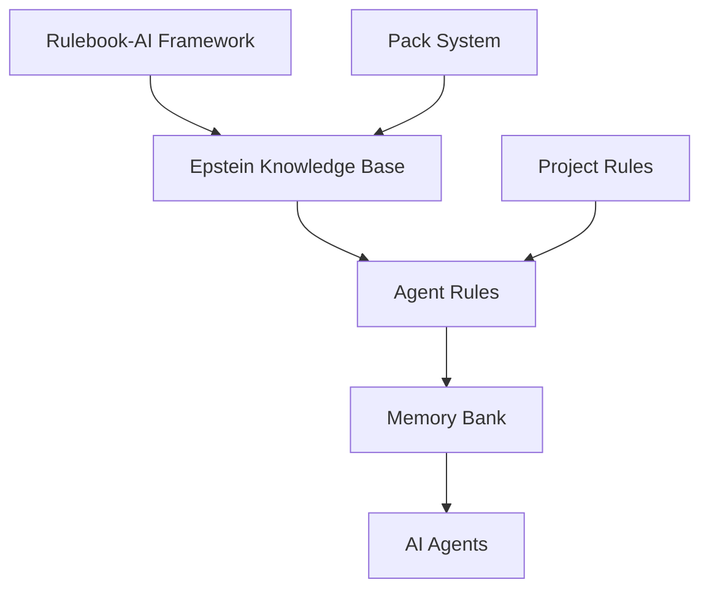

# Rulebook-AI Integration - Epstein Project

## Overview

This document describes the integration of Rulebook-AI framework with the Epstein Project's universal knowledge base. Rulebook-AI provides structured rule management and agent behavior guidance that enhances the capabilities of our multi-agent system.

## Integration Architecture

### Components
1. **Rulebook-AI Framework**: Core rule management system
2. **Epstein Knowledge Base**: Project-specific knowledge and context
3. **Agent Rules**: Agent-specific behavior guidelines
4. **Memory Bank**: Persistent context storage
5. **Pack System**: Modular rule and knowledge packages

### Integration Flow



## Rulebook-AI Packs for Epstein Project

### 1. epstein-pipeline-pack
**Location**: `rulebook_packs/epstein-pipeline-pack/`  
**Purpose**: Pipeline-specific rules and guidelines for document processing

**Key Features**:
- Document processing workflows
- Data validation rules
- Quality assurance guidelines
- Error handling protocols

**Structure**:
```
epstein-pipeline-pack/
├── manifest.yaml
├── README.md
├── rules/
│   ├── 01-pipeline-overview.md
│   ├── 02-document-processing.md
│   ├── 03-validation-rules.md
│   └── 04-quality-assurance.md
├── memory_starters/
│   ├── product_requirement_docs.md
│   ├── technical.md
│   └── architecture.md
└── tool_starters/
    └── pipeline-tools.md
```

### 2. epstein-agents-pack
**Location**: `rulebook_packs/epstein-agents-pack/`  
**Purpose**: Agent-specific behavior guidelines and coordination rules

**Key Features**:
- Multi-agent coordination protocols
- Agent communication standards
- Task distribution guidelines
- Conflict resolution strategies

**Structure**:
```
epstein-agents-pack/
├── manifest.yaml
├── README.md
├── rules/
│   ├── 01-agent-orchestration.md
│   ├── 02-communication-protocols.md
│   ├── 03-task-management.md
│   └── 04-error-handling.md
├── memory_starters/
│   ├── agent_capabilities.md
│   ├── coordination-strategies.md
│   └── performance-guidelines.md
└── tool_starters/
    └── agent-management-tools.md
```

### 3. epstein-data-pack
**Location**: `rulebook_packs/epstein-data-pack/`  
**Purpose**: Data handling and processing rules

**Key Features**:
- Data privacy and security guidelines
- Data quality standards
- Schema validation rules
- Entity extraction guidelines

## Knowledge Base Integration

### Memory Bank Structure
The Epstein Project's knowledge base serves as the memory bank for Rulebook-AI:

```
knowledge_base/
├── srs.md                    # Software Requirements
├── features.md               # Feature specifications
├── rules.md                  # Project rules (linked from rulebook-ai)
├── agents.md                 # Master agent documentation
├── project_summary.md        # Project overview
└── agents/                  # Agent-specific documentation
    ├── core/
    ├── database/
    ├── orchestration/
    └── specialized/
```

### Rule Integration Points

#### 1. Agent Behavior Rules
```markdown
# Agent Behavior Guidelines

## Document Processing Agent
- Always validate documents before processing
- Use OCR confidence threshold of 0.8 or higher
- Log all processing steps with correlation IDs
- Handle errors gracefully and provide recovery options

## Data Validation Agent
- Validate against schema in `config/document_schema.json`
- Apply quality rules from `config/validation_rules.json`
- Flag low-quality results for human review
- Maintain audit trail for all validation decisions
```

#### 2. Workflow Rules
```markdown
# Processing Workflow Rules

## Batch Processing
1. Start with small test batches
2. Monitor quality metrics continuously
3. Scale up gradually based on success metrics
4. Implement checkpointing for long-running jobs

## Error Handling
1. Log all errors with context and severity
2. Attempt automatic recovery when possible
3. Escalate to human oversight after 3 failures
4. Document all recovery attempts
```

## Configuration Management

### Rulebook-AI Configuration
```yaml
# .rulebook-ai/selection.json
{
  "packs": [
    {
      "name": "epstein-pipeline-pack",
      "version": "1.0.0",
      "source": "local"
    },
    {
      "name": "epstein-agents-pack", 
      "version": "1.0.0",
      "source": "local"
    },
    {
      "name": "epstein-data-pack",
      "version": "1.0.0", 
      "source": "local"
    }
  ]
}
```

### Agent-Specific Rules
Each agent has specific rules generated from the packs:

#### Document Analysis Agent Rules
```markdown
# Document Analysis Agent Rules

## Processing Guidelines
- Use Tesseract OCR with confidence threshold 0.8
- Apply image preprocessing for better OCR results
- Extract metadata before text processing
- Validate output against document schema

## Quality Standards
- Minimum text extraction confidence: 0.7
- Metadata completeness: 95%
- Processing speed: 10+ docs/minute
- Error rate: < 2%

## Communication Protocols
- Send processing status updates every 10 documents
- Notify orchestrator of batch completion
- Log errors with correlation IDs
- Provide detailed error reports for failed documents
```

#### Multi-Agent Orchestrator Rules
```markdown
# Multi-Agent Orchestrator Rules

## Task Distribution
- Distribute tasks based on agent capabilities
- Balance workload across available agents
- Prioritize critical tasks
- Monitor task completion rates

## Agent Coordination
- Use MCP protocol for all communication
- Maintain agent registry with status
- Handle agent failures gracefully
- Implement circuit breaker pattern for failing agents

## Performance Optimization
- Scale agents based on queue size
- Monitor resource utilization
- Implement auto-scaling policies
- Optimize task scheduling algorithms
```

## Platform-Specific Integration

### Cursor Integration
```markdown
# Cursor Rules for Epstein Project

## Development Guidelines
- Follow PEP 8 Python standards
- Use type hints for all functions
- Write comprehensive docstrings
- Include unit tests for all components

## Project Context
- Reference knowledge_base/ for project context
- Use agents.md for agent information
- Consult srs.md for requirements
- Follow features.md for implementation guidance
```

### Cline Integration
```markdown
# Cline Rules for Epstein Project

## Task Management
- Update task progress in knowledge_base/
- Reference SRS requirements during implementation
- Use agent documentation for integration
- Follow feature specifications for development

## Code Quality
- Maintain test coverage above 80%
- Use linting and formatting tools
- Follow security best practices
- Document all API endpoints
```

### RooCode Integration
```markdown
# RooCode Rules for Epstein Project

## Architecture Compliance
- Follow system architecture from docs/ARCHITECTURE.md
- Use established design patterns
- Maintain separation of concerns
- Implement proper error handling

## Database Guidelines
- Use migrations for schema changes
- Optimize queries for performance
- Implement proper indexing
- Maintain data consistency
```

## Implementation Guide

### Setting Up Rulebook-AI Integration

#### 1. Install Rulebook-AI
```bash
# Install rulebook-ai CLI
pip install rulebook-ai

# Initialize rulebook-ai in project
rulebook-ai init
```

#### 2. Add Epstein Packs
```bash
# Add epstein-pipeline-pack
rulebook-ai packs add epstein-pipeline-pack --source local

# Add epstein-agents-pack  
rulebook-ai packs add epstein-agents-pack --source local

# Add epstein-data-pack
rulebook-ai packs add epstein-data-pack --source local
```

#### 3. Sync Rules
```bash
# Generate agent rules
rulebook-ai project sync --cursor --cline --roocode
```

#### 4. Configure Agent Rules
```bash
# Create agent-specific rule directories
mkdir -p .cursor/rules .clinerules .roo/rules

# Generated rules will be placed in these directories
# Agents will automatically load and follow these rules
```

### Customizing Rules

#### 1. Modify Pack Rules
Edit rules in `rulebook_packs/*/rules/` directories:

```markdown
# rulebook_packs/epstein-pipeline-pack/rules/02-document-processing.md
# Modify document processing rules as needed
```

#### 2. Add Custom Rules
Create custom rules for specific agents:

```markdown
# knowledge_base/agents/custom/[agent-name]-rules.md
# Agent-specific custom rules
```

#### 3. Update Memory Bank
Update knowledge base documents:

```markdown
# knowledge_base/srs.md - Update requirements
# knowledge_base/features.md - Add new features  
# knowledge_base/agents.md - Update agent documentation
```

## Best Practices

### Rule Management
1. **Version Control**: Track all rule changes in version control
2. **Documentation**: Document rule changes and their impact
3. **Testing**: Test rule changes with agent workflows
4. **Review**: Review rule changes with team members

### Knowledge Base Maintenance
1. **Regular Updates**: Keep knowledge base current
2. **Cross-References**: Maintain links between documents
3. **Quality Assurance**: Review knowledge base quality
4. **Accessibility**: Ensure easy access for all agents

### Agent Integration
1. **Rule Loading**: Ensure agents load rules on startup
2. **Rule Updates**: Implement rule reload capabilities
3. **Compliance**: Monitor agent compliance with rules
4. **Feedback**: Collect feedback on rule effectiveness

## Monitoring and Validation

### Rule Compliance Monitoring
```python
class RuleComplianceMonitor:
    def check_agent_compliance(self, agent_id, action):
        """Check if agent action complies with rules"""
        rules = self.load_agent_rules(agent_id)
        return self.validate_action(action, rules)
    
    def monitor_rule_violations(self):
        """Monitor and log rule violations"""
        pass
```

### Knowledge Base Validation
```python
class KnowledgeBaseValidator:
    def validate_links(self):
        """Validate all internal links"""
        pass
    
    def check_completeness(self):
        """Check knowledge base completeness"""
        pass
    
    def validate_consistency(self):
        """Validate consistency across documents"""
        pass
```

## Troubleshooting

### Common Issues

#### 1. Rule Loading Failures
**Symptoms**: Agents not loading rules or using outdated rules
**Solutions**:
- Check rule file permissions
- Validate rule syntax and formatting
- Verify rulebook-ai installation
- Restart agents with rule reload

#### 2. Knowledge Base Inconsistencies
**Symptoms**: Contradictory information or broken links
**Solutions**:
- Run knowledge base validation
- Update cross-references
- Review document changes
- Restore from backup if needed

#### 3. Agent Rule Conflicts
**Symptoms**: Agents behaving unexpectedly or conflicting
**Solutions**:
- Review agent rule conflicts
- Prioritize rule precedence
- Update rule ordering
- Test with isolated agents

## Performance Considerations

### Rule Loading Optimization
- **Caching**: Cache loaded rules for fast access
- **Lazy Loading**: Load rules only when needed
- **Incremental Updates**: Update only changed rules
- **Parallel Loading**: Load rules in parallel

### Knowledge Base Performance
- **Indexing**: Create search indexes for fast lookup
- **Compression**: Compress large knowledge base files
- **Caching**: Cache frequently accessed documents
- **CDN**: Use CDN for distributed access

## Security Considerations

### Rule Security
- **Access Control**: Restrict rule modification permissions
- **Audit Logging**: Log all rule changes
- **Validation**: Validate rule syntax and security
- **Backup**: Maintain secure rule backups

### Knowledge Base Security
- **Encryption**: Encrypt sensitive knowledge base content
- **Access Control**: Restrict access to sensitive documents
- **Version Control**: Track all knowledge base changes
- **Backup**: Regular secure backups

## Future Enhancements

### Planned Features
1. **Dynamic Rule Generation**: AI-powered rule generation
2. **Rule Learning**: Learn from agent behavior
3. **Knowledge Graph**: Enhanced knowledge representation
4. **Real-time Updates**: Live rule updates

### Integration Improvements
1. **Better MCP Integration**: Deeper MCP protocol integration
2. **Cross-Platform Support**: Enhanced support for multiple AI platforms
3. **Performance Optimization**: Improved loading and performance
4. **Enhanced Monitoring**: Better monitoring and alerting

## Related Documentation

- [Rulebook-AI Documentation](rulebook-ai/README.md)
- [Agent Documentation](knowledge_base/agents.md)
- [MCP Server Setup](docs/MCP_SERVER_SETUP.md)
- [Multi-Agent System Guide](docs/MULTI_AGENT_SYSTEM_GUIDE.md)

## Support and Maintenance

For Rulebook-AI integration issues:
- **Documentation**: Check this document and rulebook-ai docs
- **Issues**: Create GitHub issues with detailed information
- **Community**: Engage with rulebook-ai community
- **Updates**: Keep rulebook-ai and packs updated
